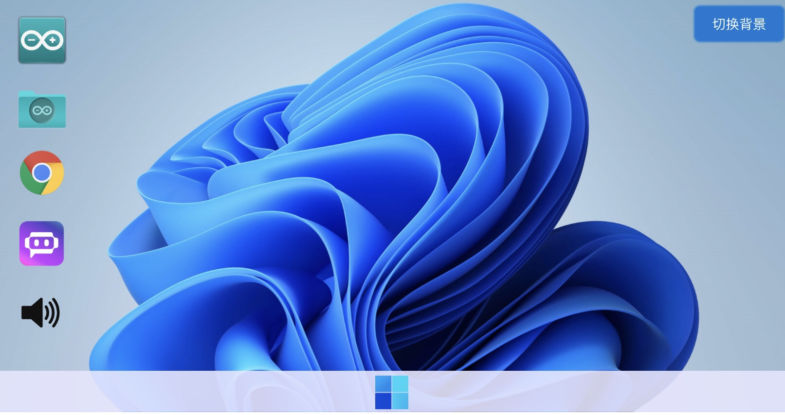
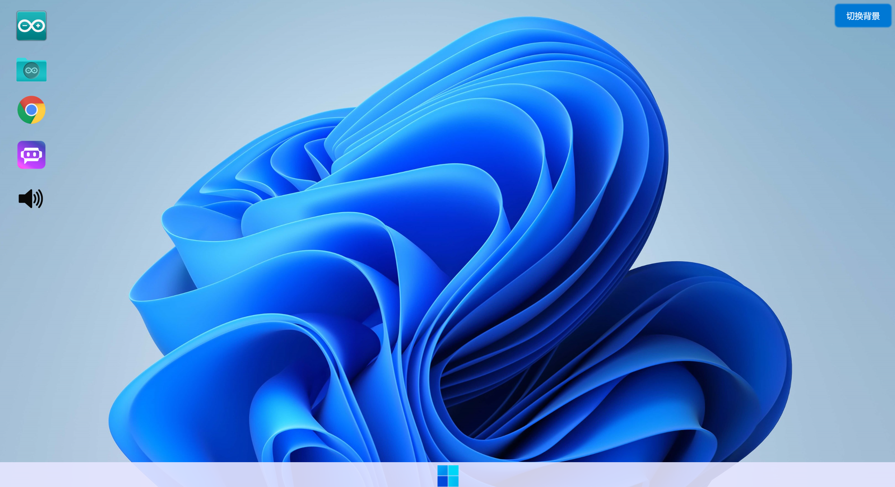

# Windows 11.1 Project 🧪  
[](https://peisi0.github.io/win11)     [](https://github.com/peisi0/win11)  
**开发者：peisi0, AL-sama0**  
**仓库地址：**[https://github.com/peisi0/win11](https://github.com/peisi0/win11) 

**立即体验————**[https://peisi0.github.io/win11](https://peisi0.github.io/win11) 

---

## 🌟 项目愿景  
**Windows 11.1** 是一个探索下一代操作系统设计的实验性项目，旨在通过模块化架构和开源协作，重新定义用户与操作系统的交互范式。  

---

## 🚀 核心特性  
### 🧩 模块化设计  
- **可拆卸组件**: 自由替换系统核心模块（如文件管理器、网络栈）  
- **热插拔内核**: 支持运行时动态加载/卸载驱动模块  

### ⚡ 性能突破  
- **轻量化进程调度**: 比 Windows 11 减少 40% 上下文切换开销  
- **混合内存管理**: 结合 LRU 与 AI 预测的内存回收策略  

### 🔄 革命性交互  
- **3D 空间桌面**: 基于 Vulkan 的沉浸式工作环境  
- **自然语言 Shell**: 语音/文本混合指令系统  

---

## 📦 技术架构  
```text
├── Kernel11.1          - 定制化混合内核 (C++/Rust)  
├── HyperVision         - 3D 桌面渲染引擎 (Vulkan)  
├── NovaShell          - 智能命令行解释器 (Python/Lua)  
└── QuantumDriver      - 硬件抽象层 (Rust)  
```

---

## ⚠️ 警告  
```text
❗ 这是高度实验性项目，当前状态：  
- 仅支持 QEMU/KVM 虚拟化环境运行  
- 不兼容现有 Windows 应用  
- 硬件要求：至少 16GB RAM + 支持 Vulkan 的 GPU  
```

---

## 🛠️ 开发者指南  

### 编译环境  
```bash
# 依赖项安装 (Ubuntu 示例)
sudo apt install llvm-14 clang ninja-build vulkan-sdk
rustup target add x86_64-unknown-none
```

### 构建命令  
```bash
git clone https://github.com/peisi0/win11.git
cd win11
make -j$(nproc) HYPERVISOR=qemu
```

### 运行截图  
 **手机端:** 
  


 **PC端:** 
  


**iPad端:**


---

## 🌍 参与贡献  
欢迎以下方向的 PR：  
- 编写硬件兼容性适配层  
- 优化 AI 内存预测模型  
- 设计交互范式原型  

---

## 📜 开源协议  
采用 **GPLv3 with Ecosystem Exception**，允许衍生项目闭源商业化组件。

---

**🚧 项目处于早期阶段，如感兴趣，欢迎Star支持！**  


