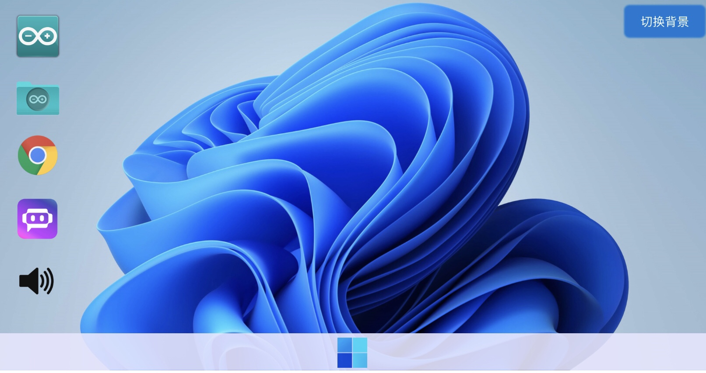
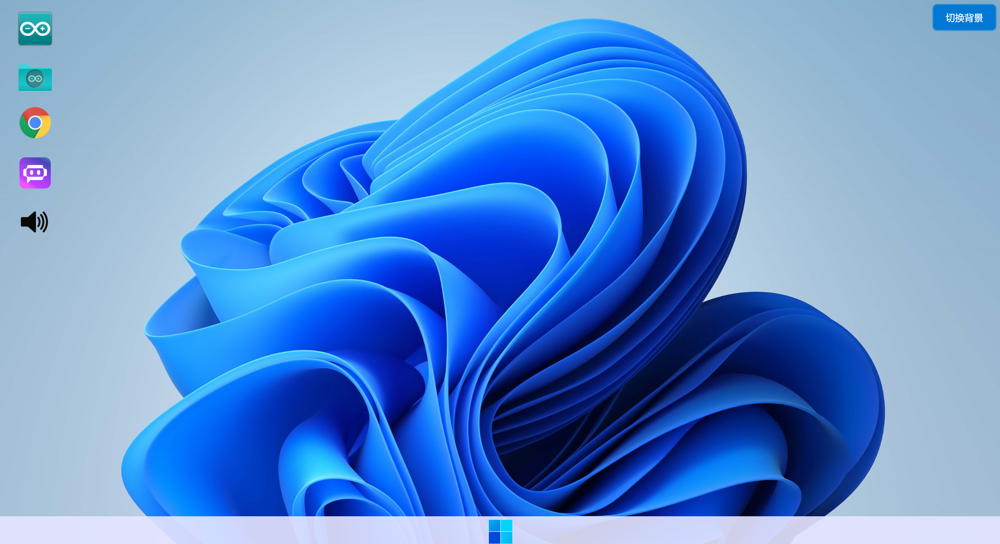

# Windows 11 Web Simulator 🪟

[](https://peisi0.github.io/win11)
[](https://github.com/peisi0/win11)

**Developers:** peisi0, AL-sama0  
**Repository:** [github.com/peisi0/win11](https://github.com/peisi0/win11)

## [🚀 Try it Now](https://peisi0.github.io/win11)

---

## ✨ Features

### 🎨 Modern UI
- **Glassmorphism Design** - Frosted glass effects with backdrop blur
- **Smooth Animations** - CSS transitions and transforms
- **Responsive Layout** - Works on desktop, tablet, and mobile
- **Dark/Light Theme** - Toggle between themes

### 🖥️ Desktop Experience
- **Desktop Icons** - Click to launch applications
- **Start Menu** - Pinned apps with search functionality
- **Taskbar** - Windows 11-style centered taskbar
- **Quick Actions Panel** - Wi-Fi, Bluetooth, Night Light toggles
- **Context Menu** - Right-click for desktop options

### ⏰ Clock Application
- **Digital Clock** - Large, modern digital time display
- **Analog Clock** - Smooth sweeping second hand
- **Both Modes** - View digital and analog together
- **Date & Timezone** - Full date and timezone info

### 🔔 System Features
- **Notifications** - Toast-style notifications
- **Wallpaper Switching** - 4 beautiful backgrounds
- **Sound Effects** - Audio feedback
- **Keyboard Shortcuts** - Meta key, Escape support
- **LocalStorage** - Remembers your preferences

---

## 📁 Project Structure

```
win11/
├── index.html          # Main desktop page
├── css/style.css       # Modern Windows 11 styling
├── js/script.js        # Interactive functionality
├── clock/              # Clock application
│   └── index.html      # Digital + Analog clock
├── assets/
│   ├── background/     # Wallpapers (bg1-4.png)
│   ├── Icon_img/       # Application icons
│   ├── sound/          # Audio files
│   └── docs/           # Screenshots
└── README.md
```

---

## 🎮 How to Use

1. **Start Menu** - Click Windows logo or press `Win` key
2. **Search** - Type in search box, press Enter to Bing search
3. **Quick Actions** - Click clock to open action center
4. **Change Wallpaper** - Click gear icon or right-click desktop
5. **Theme Toggle** - Find in start menu or context menu
6. **Clock App** - Click "Clock" in start menu for full clock view

---

## 📸 Screenshots

| Mobile | Desktop | iPad |
|--------|---------|------|
|  |  |  |

---

## 🛠️ Technologies

- **HTML5** - Semantic structure
- **CSS3** - Variables, Flexbox, Grid, Animations
- **JavaScript** - Vanilla JS, no frameworks
- **LocalStorage** - Persistent preferences

---

## 🤝 Contributing

PRs welcome! Areas to contribute:
- New applications/widgets
- Additional wallpapers
- Accessibility improvements
- Mobile optimizations

---

## 📜 License

Open source - feel free to learn from and build upon this project!

---

**⭐ Star this repo if you like it!**
